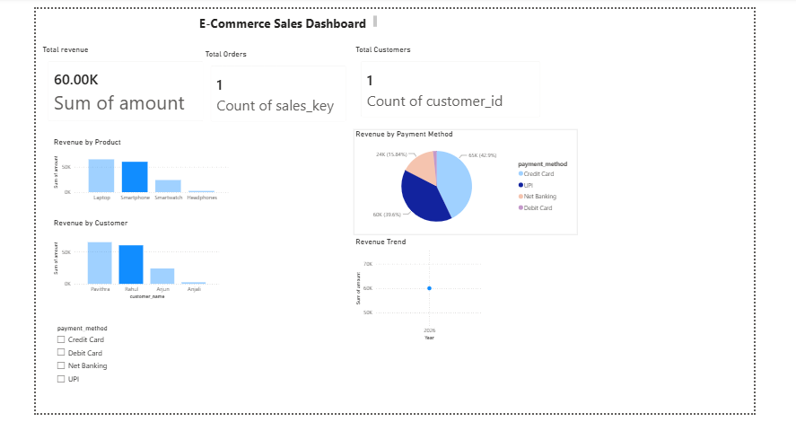
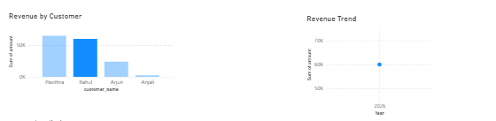

# End-to-End E-Commerce Data Warehouse and Analytics Platform

## Overview

This project demonstrates the design and implementation of an End-to-End E-Commerce Data Warehouse and Analytics Platform using Python, PostgreSQL, SQLAlchemy, SQL, and Power BI.

The solution follows a complete data engineering workflow from raw data ingestion to analytical reporting through a dimensional data warehouse and interactive dashboard.

## Tech Stack

* Python
* Pandas
* PostgreSQL
* SQLAlchemy
* SQL
* Power BI
* Git & GitHub

## Architecture

Raw CSV Files → ETL Pipeline → PostgreSQL Data Warehouse → Star Schema → Power BI Dashboard

## Data Model

### Dimension Tables

* dim_customer
* dim_product
* dim_payment
* dim_date

### Fact Table

* fact_sales

## ETL Process

### Extract

* Read source CSV files using Pandas

### Transform

* Clean and standardize customer and transaction data

### Load

* Load transformed data into PostgreSQL warehouse tables

## Dashboard Features

### KPI Cards

* Total Revenue
* Total Orders
* Total Customers

### Visualizations

* Revenue by Product
* Revenue by Customer
* Revenue by Payment Method
* Revenue Trend Analysis

### Filters

* Payment Method Slicer

## Key Metrics

| Metric          | Value   |
| --------------- | ------- |
| Total Revenue   | 151.50K |
| Total Orders    | 4       |
| Total Customers | 4       |

## Dashboard Screenshots

### Complete Dashboard

### Revenue by Product

### Revenue Trend

## Project Structure

ecommerce-data-warehouse/

├── dashboards/

├── data/

├── docs/

├── etl/

├── screenshots/

├── sql/

├── README.md

└── requirements.txt

## How to Run

1. Clone the repository
2. Install dependencies

pip install -r requirements.txt

3. Configure PostgreSQL
4. Run ETL pipeline
5. Connect Power BI to warehouse tables

## Business Insights

* Identified revenue contribution by product category
* Analyzed customer-level revenue performance
* Compared payment method usage and revenue impact
* Monitored sales trends over time

## Future Enhancements

* Larger datasets
* Automated scheduling
* Additional KPIs
* Advanced dashboards
